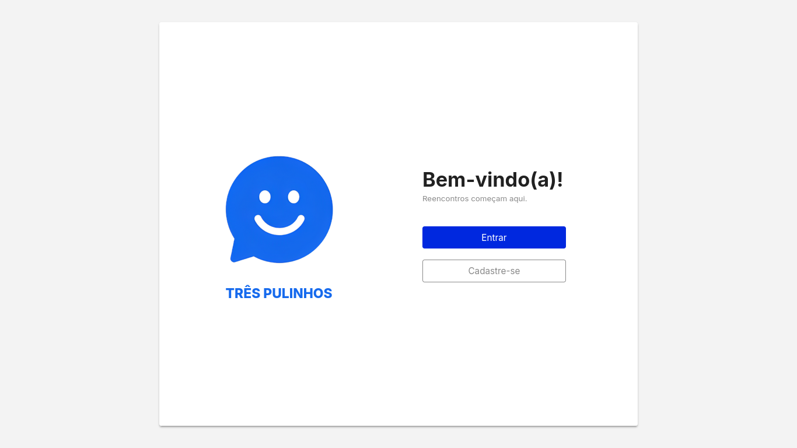
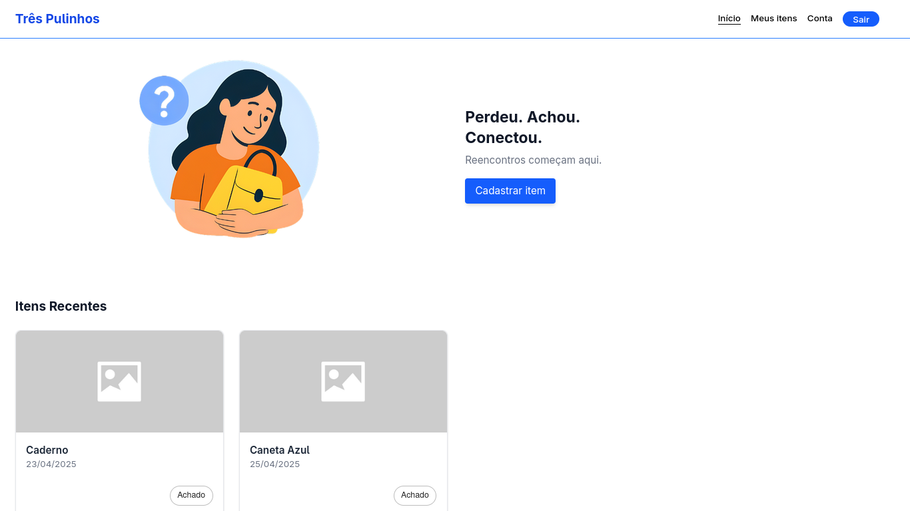

# Três Pulinhos


<div style="display: flex; justify-content:center; gap: 12px;">
  
  
</div>

## Sobre
Três Pulinhos é o front-end de um projeto desenvolvido durante o bootcamp da [Escola Atlântico Avanti](https://www.atlanticoavanti.com.br/) no curso de Full Stack. O projeto consiste em um sistema de achados e perdidos, onde os usuários podem cadastrar itens que perderam ou encontraram, e também podem visualizar os itens cadastrados por outros usuários. 

## Funcionalidades
- Cadastro de itens perdidos e encontrados
- Listagem de itens cadastrados por outros usuários
- Cadastro de usuários
- Login de usuários
- Edição e exclusão de itens cadastrados
- Edição e exclusão de usuários
- Listagem de itens cadastrados pelo usuário logado

## Tecnologias utilizadas
- [React](https://reactjs.org/)
- [Vite](https://vitejs.dev/)
- [Axios](https://axios-http.com/)
- [React Router Dom](https://reactrouter.com/en/main)
- [TailwindCSS](https://tailwindcss.com/)
- [Material UI](https://mui.com/)

## Pré-requisitos
- [Node.js](https://nodejs.org/en/) (versão 16 ou superior)
- [npm](https://www.npmjs.com/) (geralmente já vem instalado com o Node.js)

## Como rodar o projeto

> Observação: O projeto depende de uma API para funcionar. Para rodar o projeto, é necessário ter a API [três-pulinhos-api](https://github.com/thebiatriz/BACK_achados-perdidos)

### 1. Clone o repositório
```bash
git clone https://github.com/elizadora/front-achados-perdidos.git

cd front-achados-perdidos
```

### 2. Instale as dependências
```bash
npm install
```
### 3. Configure as variáveis de ambiente 
Renomeie o arquivo `.env.example` para `.env` e configure as variáveis de ambiente de acordo com o seu ambiente de desenvolvimento.


### 4. Inicie o servidor de desenvolvimento
```bash
npm run dev
```
### 5. Acesse o projeto no navegador
```bash
http://localhost:5173
```

## Rotas da Aplicação
| Rota | Descrição |
|------|-----------|
| `/` | Página inicial  - onde é exibido um card para logar ou se cadastrar|
| `/cadastro-usuario` | Página de cadastro - onde o usuário pode se cadastrar |
| `/login` | Página de login - onde o usuário pode fazer login na aplicação |
| `/principal` | Página princial - exibida após o login onde o usuário pode visualizar os itens cadastrados por outros usuários e ter acesso ao resto da aplicação |
| `/meus-itens` | Página de itens do usuário - onde o usuário pode visualizar os itens cadastrados por ele, editar e excluir |
| `/conta` | Página de conta - onde o usuário pode editar e excluir sua conta |


